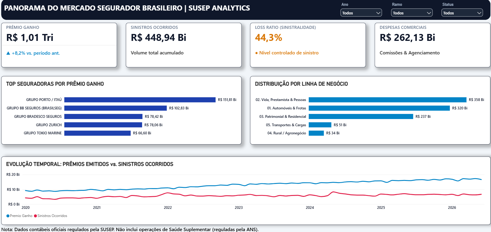
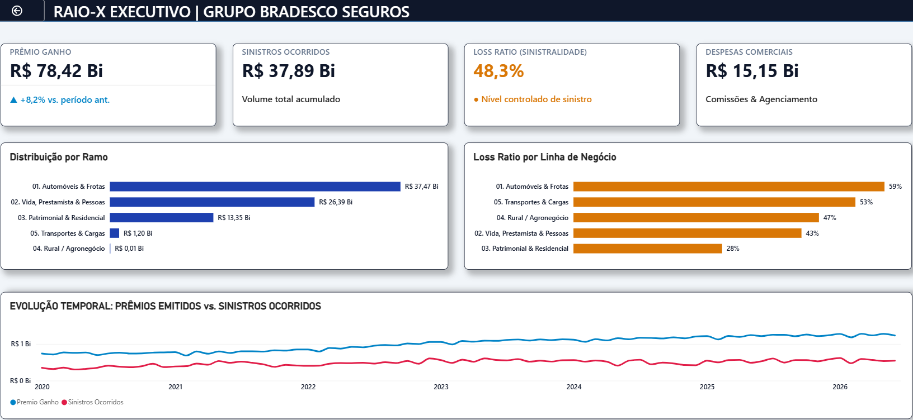

# 📊 Panorama do Mercado Segurador Brasileiro | SUSEP Analytics

[](https://powerbi.microsoft.com/)
[](https://python.org/)
[](https://sqlite.org/)
[](https://learn.microsoft.com/pt-br/dax/)

Pipeline de dados end-to-end e dashboard executivo de Business Intelligence desenvolvido para analisar a dinâmica contábil, sinistralidade (*Loss Ratio*) e posicionamento de mercado das seguradoras no Brasil reguladas pela **SUSEP (Superintendência de Seguros Privados)**.

---

## 🖼️ Visão do Dashboard

| Visão Executiva Macro | Raio-X da Seguradora (Drill-Through) |
| :---: | :---: |
|  |  |

---

## 🎯 Contexto de Negócio & Objetivos

O projeto consolida dados contábeis oficiais para responder a perguntas estratégicas de diretoria e inteligência de mercado:

1. **Market Share & Concentração:** Identificar quais grupos econômicos dominam a captação de prêmios no país.
2. **Mix de Carteira:** Mapear a representatividade de cada linha de negócio (Vida, Auto, Patrimonial, Rural, Cargas).
3. **Eficiência Técnica (Loss Ratio):** Acompanhar a margem técnica operacional e a sinistralidade por conglomerado.
4. **Auditoria Individual (Drill-Through):** Permitir um diagnóstico sob demanda por player com detalhamento de ramos e sinistros.

> *Nota Técnica: Dados contábeis oficiais regulados pela SUSEP. Não inclui operações de Saúde Suplementar (reguladas pela ANS).*

---

## 🧠 Indicadores & Modelagem DAX

* **Prêmio Ganho:** Volume contábil de prêmio reconhecido após diferimento do prêmio não ganho.
* **Sinistros Ocorridos:** Custo total de indenizações avisadas e liquidadas no período.
* **Loss Ratio (% Sinistralidade):**
  $$\text{Loss Ratio} = \frac{\text{Sinistros Ocorridos}}{\text{Prêmio Ganho}} \times 100$$
  *Resultado consolidado de **44,3%**, indicando rentabilidade técnica saudável.*
* **Market Share % (Dinâmico):**
  $$\text{Market Share} = \frac{\text{Prêmio Ganho (Seguradora)}}{\text{Prêmio Ganho (Total Mercado)}}$$
* **Despesas Comerciais:** Custos de intermediação, agenciamento e comissões de corretagem.

---

## 🏗️ Arquitetura e Engenharia de Dados

```mermaid
graph LR
    A[Dados Abertos SUSEP / SES] -->|Download & Extração| B[Python ETL Scripts]
    B -->|Normalização & Grupos| C[(SQLite Database)]
    C -->|Star Schema Otimizado| D[Power BI Desktop]
    D -->|DAX Engine & UI Executiva| E[Executive Dashboard]